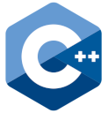

<!-- Begin First Section -->
<h1> Alberto Lazo </h1>

Android Developer - Software Engineer - Claims Specialist | C++, Java, Kotlin, Python | Node, Express, PostgreSQL, REST, FreeBSD, UNIX, Linux. 

Curious, creative, builder, problem solver, driven, disciplined, focused.

<!-- End First Section -->

<!-- Begin Second Section -->

<!-- Languages and Tools -->
<h2 style="color: #44AEFB">⚙️ Languages and Tools</h2>

     

     
  
     

          

     

     
     

     

     
  
  
  
  
  
  
      
      
      

<!-- End Second Section -->

# Connect with me

 
 
 

# Languages

- 👋 Hi, I’m @betolix
- 👀 I’m interested in 
- 
- CleanCode, Software crafting, SOLID, DRY, YAGNI
- 
- Android: Presentation patterns (MVC, MVVM, MVI). 
-           Activities, fragments, lifecycle management, Livedata, flow, shared flow, state flow, 
-           viewModel, repository,  room (sqlite, DAO), remote data sources,  sensors, json, geojson, 
-           coroutines, retrofit, web services, 
-           Dependency Injection (Dagger, HILT) 
-           Testing.
- Geolocation: QGIS,n GeoJson 
- Languages: C++, Java, Kotlin, Python
- Databases: PostgreSQL, PostGIS 
- FreeBSD, UNIX, Linux, Monolyths, Microservices, Docker, Kubernetes.
- 🌱 I’m currently learning Microservic
- 💞️ I’m looking to collaborate on open source projects
- 📫 How to reach me ...
- betolix@gmail.com
- blix@h3llo.io
- AlbertoLAzoB@gmail.com

<!---
betolix/betolix is a ✨ special ✨ repository because its `README.md` (this file) appears on your GitHub profile.
You can click the Preview link to take a look at your changes.
--->
